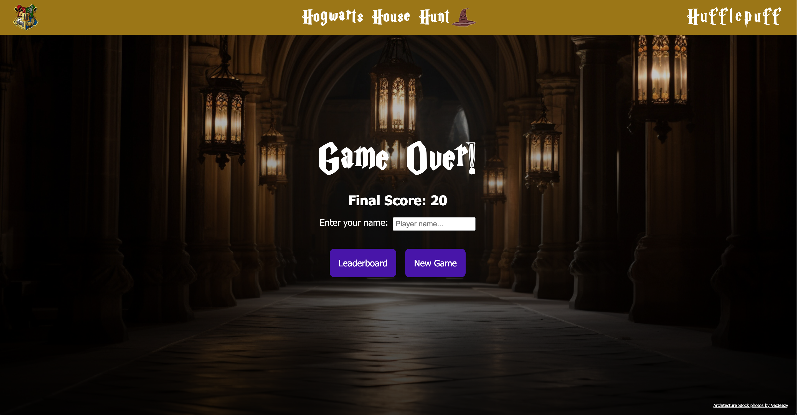

# Hogwarts House Hunt

Hogwarts House Hunt is a Harry Potter themed trivia browser game. Players test their knowledge by guessing the Hogwarts house of various characters displayed on the screen. Choose your house, customize your experience, and compete for a spot on the leaderboard!

## Play Now

The game is live at [https://hogwarts-house-hunt.vercel.app/](https://hogwarts-house-hunt.vercel.app/). Open it in your desktop browser to start playing!

Note: The game is currently built for desktop, mobile styles are being worked on.

## Features

- **House Selection**: Choose to play as Gryffindor, Hufflepuff, Ravenclaw, or Slytherin, which sets a unique color theme configuration for your game.
- **Gameplay**:
  - View the current round and your score.
  - Guess the Hogwarts house of a displayed character.
  - Receive immediate feedback (correct/incorrect) on your guess.
  - Scoring:
    - Correct guess: Increases your score, with a bonus if the character belongs to your chosen house.
    - Incorrect guess: Decreases your score, with an additional penalty if the character is from your chosen house.
- **Leaderboard**: Displays house totals and individual player rankings based on scores.
- **Configuration**:
  - Home page allows players to toggle sound (powered by Howler.js) and select their house.

## Screenshots

1. **Home Page**: Welcome screen with house selection and sound toggle.  
   

2. **Game Screen**: Gameplay showing round, score, character, and house options.  
   

3. **Feedback Screen**: Game over page with final score and name input.
   

4. **Leaderboard**: House totals and player rankings.  
   

## Technologies Used

- **Angular**
- **Howler.js**
- **CSS**
- **TypeScript**
